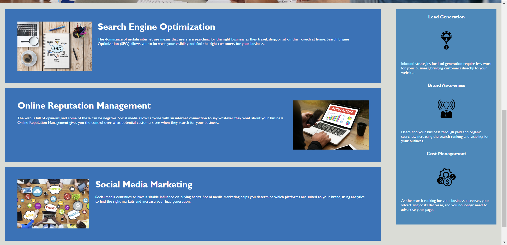

# code-refactor-horiseon

## Description

I refactored the HTML and CSS code for the Horiseon website so that future developers could view the code with ease after it became semantically correct and ordered. The Horiseon code was initially somewhat jumbled yet functioned, so the refactor helped structure the code in a satisfactorial and professional way.

## Installation

The only installation-related item is to be able to open the website in a web browser.

## Usage

The website is largely informative of the services that Horiseon provides; refactoring of the code has not changed the function of the website and therefore keeps the usage relatively simple. There are links on the website that can take users to the different sections of the website. The three links in the navbar correspond to the three main sections of the landing page, which can be clicked on when viewing the top of the webpage. Here are two screenshots showing what the front end of the page looks like:

## Credits

For this README file, I used the UW Bootcamp Prework README formatting.

## License

This website uses the MIT license.
